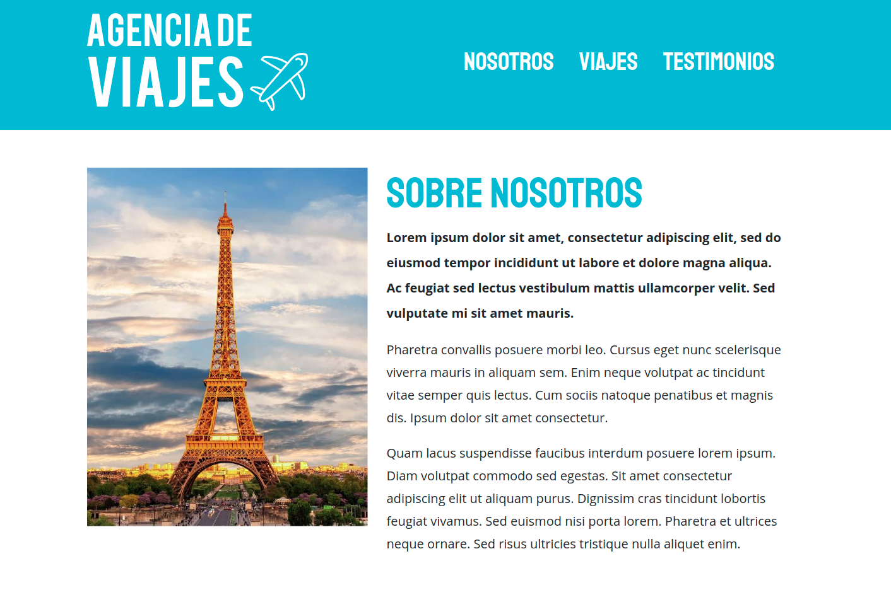
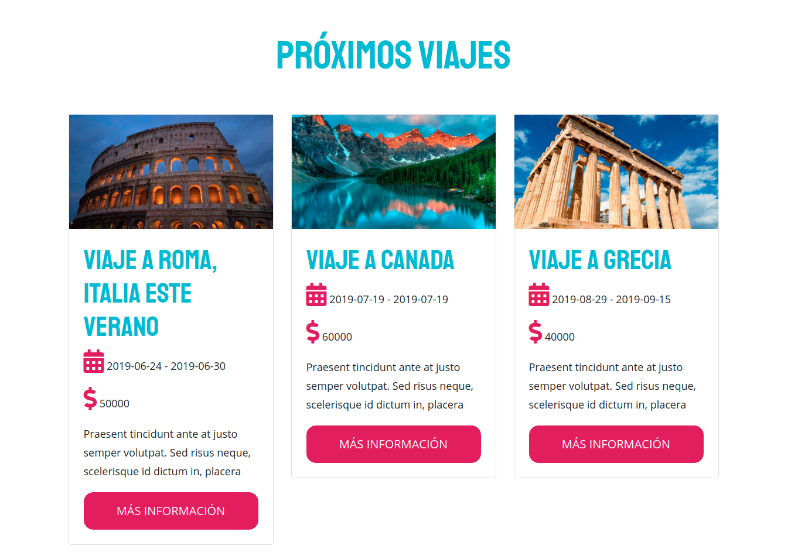
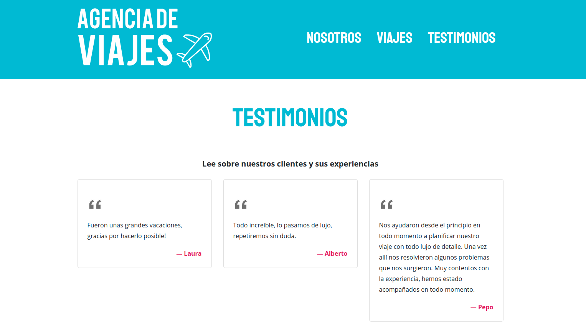

## · Website from a Travel Agency using NodeJS, Express and Sequelize ·

Based on the [Udemy Course](https://www.udemy.com/course/javascript-moderno-guia-definitiva-construye-10-proyectos) given by [Juan Pablo de la Torre Valdez](https://twitter.com/JuanDevWP).

- Using PUG as a Template Engine and Bootstrap

        

        

        

        

